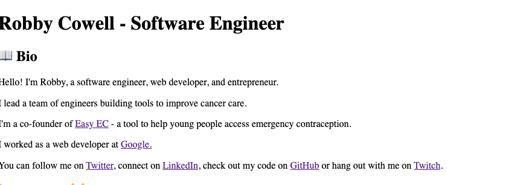
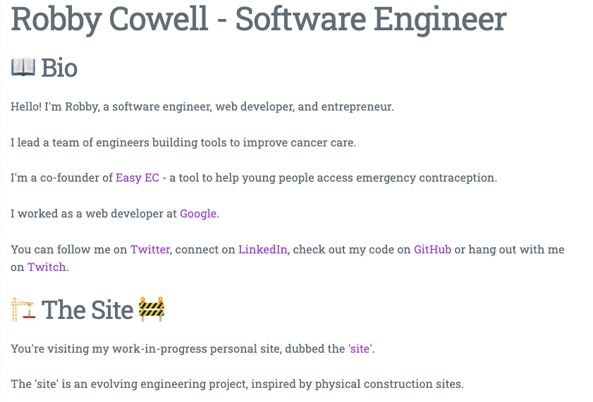




# Log 004: The Basics
So the articles for `the site` are now stored as plain Markdown files, which are then imported and rendered from [Svelte](https://svelte.dev/).

I want to clean things up before I start going exploring solutions for a hybrid web-app.

The tasks I want to tackle are:
 - Create a simple interface to display the articles separately as opposed to dumping them all on the page ([#3](https://github.com/RobbyCowell/site/issues/3))
 - Write a script that generates ([#4](https://github.com/RobbyCowell/site/issues/4)):
	 - The scaffolding for a new article
	 - The metadata for a new article
- Make `the site` a somewhat functioning website that can replace the old robbycowell.com ([#5](https://github.com/RobbyCowell/site/issues/5))
- Add some basic, and lightweight styles to `the site` ([#6](https://github.com/RobbyCowell/site/issues/6))
- Associate each log to a Netlify build and Git Commit ([#7](https://github.com/RobbyCowell/site/issues/7))

The numbered links next to each task above are links to the GitHub issues. I plan to track all tasks for the project this way.

## Creating a user interface to show the posts [#3](https://github.com/RobbyCowell/site/issues/3)
I'm excited about this one, it's the first task that will really involve writing some [Svelte](https://svelte.dev/) code!

### The `articles` module
The first thing I did was clean up `App.svelte`, and import all articles into an `articles.js` module that looked like this:
```
import One from './001-the-brief/001-the-brief.svelte';
import Two from './002-the-setup/002-the-setup.svelte';
import Three from './003-the-articles/003-the-articles.svelte';

const articles = {
  One,
  Two,
  Three
};

export default articles;
```
Then in `App.svelte` I can just import the whole `articles` module like so:
```
import articles from './articles/articles.js';
```
Then I can render a specified article by doing something like this:
```
<svelte:component this={articles[articleKey]} />
```
It should also be relatively simple to automate the maintenance of `articles.js` through the script I plan to write for [#4](https://github.com/RobbyCowell/site/issues/4).

### Displaying the articles
Now I have a nice object of articles, I should be able to access each one pretty easily.

We need a way to track which article is currently being displayed:
```
let articleToShow = null;
```
Then we need a way to change the article being displayed:
```
function selectArticle(articleId) {
  articleToShow = articleId;
}
```

Now we can render a list of articles and display the respective article `on:click`:
```
<h3>Articles</h3>
<ul>
  {#each Object.keys(articles) as article}
    <li>
      <a 
        on:click={() => selectArticle(article)}
        href="#{`article-${articleToShow}`}"
      >
        {article}
      </a>
    </li>
  {/each}
</ul>
```

### Bringing in the metadata
So far so good. We're dynamically displaying a list of articles and then displaying the relevant article based on the user's selection.

But there's a problem: the app doesn't know about each article's metadata. Let's fix that.

First, let's make each article component a module and explicitly export our metadata:
```
// 001-the-brief.svelte
<script context="module">
  import metadata from './001-the-brief-metadata.js';
  import article from './001-the-brief.md';

  export const data = metadata;
</script>

<div>
  {@html article}
</div>
```
Now I'm going to pull in that data to `articles.js` and export an object for each article, which will have two properties: `content` and `data`.

`articles.js` now looks like this:
```
import One, { data as articleOneData } from './001-the-brief/001-the-brief.svelte';
import Two, { data as articleTwoData } from './002-the-setup/002-the-setup.svelte';
import Three, { data as articleThreeData } from './003-the-articles/003-the-articles.svelte';

const articles = {
  'one': { content: One, data: articleOneData },
  'two': { content: Two, data: articleTwoData },
  'three': { content: Three, data: articleThreeData }
};

export default articles;
```
The metadata should now exist in the `articles.js` module! Let's try displaying the slug at the top of each article:
```
// App.svelte
<div>
  {#if articleToShow}
    <h3>Slug: {articles[articleToShow].data.slug}</h3>
    <svelte:component this={articles[articleToShow].content} />
  {/if}
</div>
```
*Note that I needed an if statement here to avoid issues in cases where no article is selected but we're trying to display one*

That should do it, selecting each article now shows its slug as intended!

You can browse the source code as this point [here](https://github.com/RobbyCowell/site/tree/c8d9ada2135f52e18f7a57b163e212d120177e84)

## Creating an article scaffolding script [#4](https://github.com/RobbyCowell/site/issues/4)
To be able to create articles easily without loads of copy/pasting and boilerplate, I'm going to write a script that generates everything I need to get an article set-up.

I'm going to keep it JS, and write a [Node](https://nodejs.org/en/docs/) script to do this and then run it with `npm`.

### Creating the script and templates
First thing's first, I created a `scripts` dir at the root level to house any scripts and templates.

I then created a template for each file I want to generate in `scripts/templates`:

```
/scripts
  /templates
    article-component-template.svelte
    article-markdown-template.svelte
    article-metadata-template.svelte
```

I then copied the code from the existing files, replacing any dynamic properties with a `${propName}` pattern, for example, this is what `article-metadata.svelte` looks like:

```
const metadata = {
  publishDate: '$date',
  slug: '$slug',
};

export default metadata;
```

`$slug` and `$date` are going to be the dynamic properties my script will populate; for now.

Now that I have my template files, I can create a Node script to generate new article files from them: `scripts/create-article.js`.

At this point, many engineers would pull in templating libraries and scripts for this, however it's relatively easy to achieve what I want to do with Node's built-in libraries, namely it's File System (`fs`) module.

The `create-article.js` script, here's what my first attempt looked like:
```
fs = require('fs');

const articlesPath = './src/articles/';
const templatesPath = './scripts/templates/';

createArticle = (articleName) => {
  const articlePath = articlesPath + articleName;

  // Create article directory
  fs.mkdir(articlePath, (err) => {
    if (err) throw err;
  });

  createMetadata(articleName, articlePath);
}

createMetadata = (articleName, articlePath) => {
  var metadataFilePath = `${articlePath}/${articleName}-metadata.js`;

  fs.readFile(`${templatesPath}/article-metadata-template.js`, 'utf-8', (err, data) => {
    if (err) throw err;

    data = data.replace(/\$date/g, new Date(Date.now()));
    data = data.replace(/\$slug/g, articleName);

    fs.writeFile(metadataFilePath, data, (err) => { 
      if (err) throw err;

      console.log(`metadata file created: ${metadataFilePath}`);
    });
  });
}

createArticle('test-article');
```
Essentially, the `createMetadata` function:
- Reads the template file to a `data` stream
- Performs a regex search for the dynamic property markers I defined earlier (`$slug` and `$date`)
- Replaces these marker strings with the actual values I want
- Writes the modified data stream to a new file

Running `node ./scripts/create-article.js` now creates the `test-article` directory and the `test-article-metadata.js` file in that directory!

Great, everything works as expected, and I've written the code in such a way that I can have as many `createX` functions as necessary.

The next step is to write similar functions for all the template files, which should be simple.

### Automating maintenance for `articles.js`

The eagle-eyed may have noticed that I'm generating a `.svelte` file for each article containing basically is the same code every-time.

I'm going to create a reusable `article` svelte component to handle this, and remove the `${article-name}.svelte` file from each `articles` sub-directory. 

This will make the entire `articles` directory completely transportable, as all articles will be composed of just POJO and Markdown files.

I created a `src/components` directory and created `Articles.svelte`, which is basically the same boring file I've been using for each article so far:

```
<script>
  export let metadata;
  export let content;
</script>

<div>
  {@html content}
</div>
```
And in `App.svelte` I just pass the data down as props:
```
<Article 
  metadata={articles[articleToShow].data}
  content={articles[articleToShow].content}
/>
```

At this point, I may as well automate the maintenance of `articles.js`.  I'll write a function that  looks through all of the `articles` subdirectories and generates the necessary code in `articles.js`. I'll call this function after the templating functions have run.

I added the `refreshArticles()` function to `create-article.js`, which looked like this:
```
refreshArticles = () => {
  let data;
  
  const articles = fs.readdirSync(articlesPath, { withFileTypes: true })
    .filter(dirEntry => dirEntry.isDirectory())
    .map(dirEntry => dirEntry.name);

  const importStatements = articles.map((article, index) => {
    return `import Article${index}Content from './${article}/${article}.md';\nimport Article${index}Data from './${article}/${article}-metadata.js';\n`
  });

  const articlesObject = articles.map((article, index) => {
    return `'${article}': { content: Article${index}Content, data: Article${index}Data }\n`
  });

  data = `${importStatements.join('')}\n`;
  data += `const articles = {\n${articlesObject}};\n`;
  data += `\nexport default articles;`;

  console.log(data)

  fs.writeFile(`${articlesPath}articles.js`, data, (err) => { 
    if (err) throw err;

    console.log('Articles.js updated');
  });
}
```
The generated `articles.js` is not the prettiest in terms of formatting, but I can fix that with [prettier](https://prettier.io/) (or similar) later rather than messing around trying to get the formatting right in the script.

### Cleanup
Now I can go through and delete all of the per-article `.svelte` files and use the `articles` dir and the `create-article` script in any Node-based system.

All that's left to do is create an npm script to call `createArticle()`.

NPM scripts are still kind of clunky, but I can achieve this by adding this to the scripts property in `package.json`:
```
"create-article":  "node ./scripts/create-article.js",
```
Adding a check for environment variables at the start of `createArticle()`:
```
  const args = process.argv.slice(2);
  const articleName = args[0];
```
And finally have the file call `createArticle()` at the bottom of the file so it runs when it's invoked by node:
```
createArticle();
```
Now I can run this from the terminal:
```
npm run create-article test-article
```
The result is the same as earlier, the only difference is I'm passing in the name of the article through an env var, and can now call this script straight from the root of my directory cleanly!

You can browse the source code at this point [here](https://github.com/RobbyCowell/site/tree/791b29cb8bf108803d043b788c1e6a59d9f38d6c).

## Make `the site` function as personal site [#5](https://github.com/RobbyCowell/site/issues/5)
So the 'site' is no longer an article dumping-ground, let's go one step further and have it function as my personal (albeit ugly) homepage.

### Separating content and code
I started writing my bio in HTML/JS and just can't bring myself to do it any longer. So, like the articles, I'm going to store the site's content in markdown files too.

Going one step further, I want to decouple the content and the code completely, so I'm going to create a new top-level directory: `content`, where all of site's content and articles will live.

The abbreviated directory structure now looks like this:
```
content/
  articles/
    001-the-brief/
	  001-the-brief-metadata.js
	  001-the-brief.md
	...
  bio.md
  intro.md

src/
  articles/
    articles.js // the generated file
```
I made a few changes to the `create-article.js` to account for the updated file-paths (made a lot easier by having earlier defined constants for the file-paths).

Now the `App.svelte` component can cleanly import and render the markdown files like so:
```
<script>
  import Article from './components/Article.svelte'
  
  import bio from '../content/bio.md'
  import intro from '../content/intro.md';
  import articles from './articles/articles.js';
  ...
</script>

<h1>Robby Cowell - 🏗 The Site 🚧</h1>
{@html bio}
{@html intro}
...
```
Much better than having a load of unwieldy html content polluting the code, and I'm now able to write the site's content in a markdown editor rather than html.

### Writing the content
Now this process is simple, I just wrote a bio and intro about the project. The site now has all of the essential info that allows it to function as my personal homepage!

## Add styles to the site [#6](https://github.com/RobbyCowell/site/issues/6)
As I'm writing this, the 'site' is an unstyled monstrosity:



I don't want to get too distracted by styling and branding for now, so I'm just looking for a light-weight CSS library I can use.

I settled on [Milligram](https://milligram.io/) because it looks great, doesn't require applying classes to DOM elements, and is only 2kb. Set-up is super simple:

```
npm install milligram
```

Then pull the minified CSS into my `styles.css` file
```
// styles.css
@import 'milligram/dist/milligram.min.css';
```

OK, let's see what it looks like:


Not bad, but the font is hard to read and the content is still right up against the window.

Following the docs, I wrapped all the markup in `App.svelte` in `Milligram`'s [Grid](https://milligram.io/#grids), and pulled in a different font: `Roboto Slab`.

So I added this to `App.Svelte`:
```
...
<div class="container">
  <div class="row">
    <div class="column">
      <h1>Robby Cowell - Software Engineer</h1>

      {#if !articleToShow}
        {@html bio}
        {@html intro}
      {/if}
...
```

And pulled in Roboto Slab from Google Fonts:
```
// index.html
...
<head>
...
<link rel="stylesheet" href="//fonts.googleapis.com/css?family=Roboto+Slab">
...
</head>
```

OK, let's see what it looks like:


Last thing: it's hard to see the difference between html and png's, so I added a little border to all images to differentiate the content from the images.

```
img {
  border: 3px solid #9b4dca;
  border-radius: 5px;
}
```