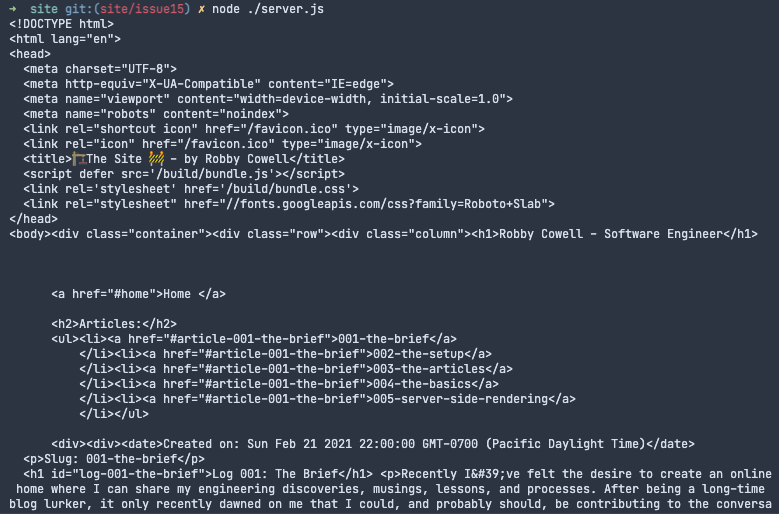

# Log 005-server-side-rendering
It's time to tackle the project's most interesting problem: server-side rendering; or SSR. 

The concept of SSR is explained well elsewhere TODO, and the problem could easily be solved by using Svelte Kit or Sapper. However, I wanted to really get my hands dirty and see what a hand-built solution would look like.

## Setting-up SSR [#15](https://github.com/RobbyCowell/site/issues/15)
Essentially, the task is to generate a static html page on a Node server, that will then be sent to the client. The static html will then be [hydrated]() when the JS bundle has loaded.

This will result in very fast load times, with the additonal benefit of allowing the site to be easily indexed and accessed by crawlers.

## Webpack configuration updates
So, how do I go about rendering the application on the server?

Svelte has a [Server-side component API](https://svelte.dev/docs#Server-side_component_API) that will let us render components in a Node environment; no DOM required. Great!

The only problem is that my app relies on markdown files which Svelte doesn't natively support. So I need to run at least part of my [Webpack](TODO) bundler on the server-side too.

So I could try something like this:
```
  module: {
    rules: [
      {
        test: /\.svelte$/,
        use: {
          loader: 'svelte-loader',
          options: {
            compilerOptions: {
              dev: !isProd,
              format: 'cjs',
              generate: isSSR ? 'ssr' : 'dom',
              hydratable: true,
            },
            emitCss: isProd,
            hotReload: !isProd
          }
        }
      },
```
Note the `generate` property, which will either be `ssr` or `dom` depending on the environment.

This makes sense conceptually, but I kept running into this error: `ReferenceError: document is not defined`, when I tried to render the result of this config on the server-side like this:

```
const App = require('./public/build/bundle-ssr.js');
console.log(App.render({}));
```

Strange, even though I asked Svelte to render the SSR version of the component, it's still looking for a DOM node.

Looking through the Webpack config again I saw this:

```
entry: {
  'build/bundle': './src/entry.js'
},
```

My entrypoint was configured to render the app like so:

```
const app = new App({
  target: document.body
});
```

This is a problem because the code is attempting to render the app to a DOM node that does not exist!

To rectify this, I configured a different entrypoint for the server that would point straight to `App.svelte`, as I want to control exactly how the app is rendered on the server anyway.

I updated my config to include this:

```
  target: ssr ? 'node' : 'web',
  entry: {
    'build/bundle': ssr ? './src/App.svelte' : './src/entry.js'
  },
```

Now I'm correctly setting the compile target, and only bundling the App itself, rather than the rendered app.

Finally, I need to make a few changes to my `output` config to handle the creation of the different client and server output files:
```
  output: {
    assetModuleFilename: 'build/images/[hash][ext][query]',
    chunkFilename: ssr ? '[name]-[id]-ssr.js' : ' [name].[id].js',
    filename: ssr ? '[name]-ssr.js' : '[name].js',
    libraryTarget: 'umd',
    path: path.join(__dirname, '/public'),
    publicPath: '/',
  },
```

I can now render the SSR version of the code with Webpack like this:

```
webpack --env production --env ssr
```

Which I contained my`package.json`'s `scripts`:

```
"build-ssr": "webpack --env production --env ssr",
```

You can see the entire `webpack.config.js` file at this stage [on the repo](TODO).

## Rendering the App on the server
All this talk of servers and I've yet to write a single line of server-side code! Let's change that.

For now, I'm going to go with `server.js` at the root of my directory, with the naive responsiblity of rendering the SSR compiled app into a static html file.

*Note: if I wasn't bundling my app before this point, I'd have to use [svelte/register](https://svelte.dev/docs#svelte_register).*

*Another note: I know what you're going to say: "I bet this guy is going to skip using Express and make life difficult for himself in a futile act of stubbornly refusing to pull in any third-party libraries", and to that, I would say, "you're right".*

*Final note IV: Revenge of GitHub's AI: while writing the next paragraph, this happened:*

<blockquote class="twitter-tweet"><p lang="en" dir="ltr">OK, (definitely not) my last Tweet about GitHub Copilot: it&#39;s actually trying to write my blog post for me (its prediction is the gray text after the cursor).<br><br>I appreciate its enthusiasm but it&#39;s not even close ha ha h- wait... that is *exactly* what I was going to do. 😨 <a href="https://t.co/yCN7fjotba">pic.twitter.com/yCN7fjotba</a></p>&mdash; Robby Cowell (@RobbyCowell) <a href="https://twitter.com/RobbyCowell/status/1453562818830032898?ref_src=twsrc%5Etfw">October 28, 2021</a></blockquote> <script async src="https://platform.twitter.com/widgets.js" charset="utf-8"></script>

OK, so in `server.js` I'm first going to import the `App` component from the `build/bundle-ssr.js` that now gets generated when I run `npm run build-ssr`.

Then I'm going to call its `render()` method which gives me an object containing the `head`, `html`, and `css`. I only want the html for now (css and head are handled by the code in `index.html`), so I'm just going to do something like this:

```
const App = require('./public/build/bundle-ssr.js').default;

const { html } = App.render({articleToShow: '001-the-brief'});
```

As an additional test, I'm also passing in a props argument: `{articleToShow: '001-the-brief'}`, to tell the App component which article I want to render. The result should be all the code in App.svelte, index.html, AND the compiled html from the markdown file of the given article.

Now I want to take that html and throw it into my `index.html` file, which will form a complete webpage ready for rendering that we can return from the server to any machine lucky enough to request it.

To do this, I added a `<!--$target-->` comment to `index.html` in the `<body>` tag. Now I can tell `server.js` to grab `index.html` and replace the comment with the html I just generated.

```
fs.readFile('./public/index.html', 'utf-8', (err, data) => {
  if (err) throw err;

  data = data.replace(/\<\!--\$target--\>/g, html);

  console.log(data);
});
```



Looks good!

I also tested writing this output to a seperate html file and opening it in the browser. After inspecting the network request I can see that the html file is being returned as it should from the server and then being subsequently hydrated by the client-side JS.

## Writing the server code
It's time to actually write something that resembles a server!

*Note to the one person reading this (most likely my future self): yes, I'm a front-end developer BUT I started as a Web Engineer and therefore make front-end engineering as complicated as possible as this project clearly demonstrates.*

### Setup
First of all, I'm going to install [`express`](https://expressjs.com/) to make life a bit easier on the server-side of things.

```
npm install express --save
```

And then in `server.js`, I started off with something like this:
```
fs = require('fs');

const express = require('express');
const app = express();
const port = 3000;

const App = require('./public/build/bundle-ssr.js').default;

app.use(express.static('public'));

app.get('/', async (req, res) => {
  const page = await generateHtml('001-the-brief');
  res.send(page);
});

app.listen(port, () => {
  console.log(`Example app listening at http://localhost:${port}`)
});

const generateHtml = async (articleToShow) => {
  const { html } = App.render({ articleToShow });
  const template = await fs.promises.readFile('./public/index.html', 'utf8');
  return template.replace(/\<\!--\$target--\>/g, html);
}
```

So, I'm just wrapping the same SSR code we just tested into an `express` server, so the server-side rendered page is returned from the server via a get request to the default route (`/`).

Starting up `server.js` again, and going to `localhost:3000/`, we can see the page being loaded successfully.

### Passing props from server to client
Something caught me out here, rendering the app without an article specified worked fine, and was successfully hydrated, but if I passed in a specific article I wanted to render on load (let's imagine someone visited the site with a URL to a specific article), the page would just load the app as if no article was specified.

This is because in `entry.js`:
```
import './styles.css';

import App from './App.svelte';

const app = new App({
  target: document.body,
  hydrate: true
});

export default app;
```

...I'm not passing in any props!

The next question is, how can the JS entry point get these props if it's outside the Svelte component. The answer is that we need the SSR code to save the prop at the global level, so `entry.js` has access to it at hydration time.

So, I first added a placeholder in my html file to hold the props:

```
  <script>
    document.app = {
      articleToShow: '$articleToShow'
    }
  </script>
```

And then in the SSR code (`server.js`), replace the placeholder in this file ($articleToShow), with the desired articleToShow:

```
template.replace(/\$articleToShow/g, `${articleToShow}`);
```

This will create the local variable: `articleToShow` in a global location `document.app`, which `entry.js` can then access.

Finally, we need to tell entry.js to pass in this prop to the root Svelte component:

```
const app = new App({
  target: document.body,
  props: { articleToShow: document.app.articleToShow }, // grab the global variable
  hydrate: true
});
```

Now in `server.js`, I can pass any (valid) article id to the `generateHtml()` function, and the correct article will render AND hydrate with the correct props!

That's enough for getting the basic server-side rendering functionality working.

The next post will focus on building the server-side rendering functionality out further, I'll cover:
  - Routing and cleaning up the URLs
  - Configuring `server.js` further to render the article based on the URL.
  - Refactor and improve code in `server.js`

Code as of writing can be seen [on the GitHub repo](https://github.com/RobbyCowell/site/commit/5f4724df659c7ef3a550f09ad344486cdbdd5c84).