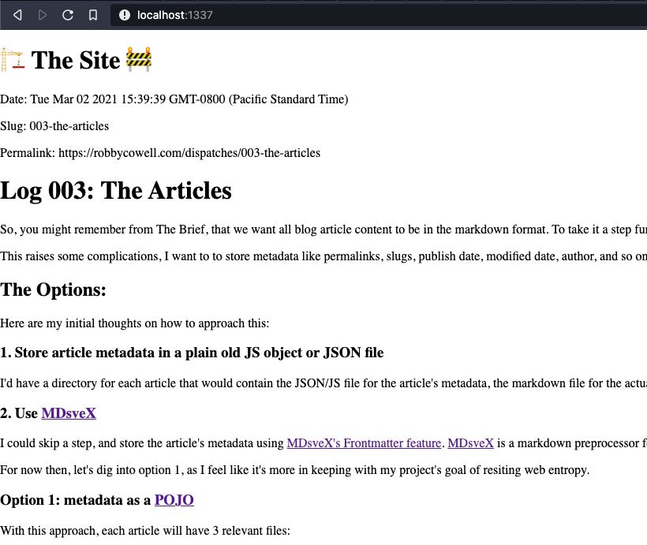

<script context="module">
  const slug = '003-the-articles'
  
  export const metadata = {
    publishDate: new Date(Date.now()),
    slug,
    permalink: `https://robbycowell.com/dispatches/${slug}`
  }
</script>

# Log 003: The Articles
So, you might remember  from The Brief, that we want all blog article content to be in the markdown format. To take it a step further, I want these articles to be 'pure' `.md` files, so no extracting from file formats like `YAML`, `MDX`, `JSX`, etc. would be required as the system and tooling choices change over time.

This raises some complications, I want to store metadata like permalinks, slugs, publish date, modified date, author, and so on, but markdown doesn't support variables out-of-the-box so I need to come up with a way to store this information and associate it with a markdown article file.

## Configuring the application to handle markdown
Before we get into the details, we need to do a bit more configuration to get markdown files working.

First, we need webpack's markdown and html loaders:
```
  npm install --save-dev html-loader markdown-loader
```

Then, we have to configure webpack to handle the files:
```
...
rules: [
  ...
  {
    test: /\.md$/,
    use: [
      'html-loader',
      'markdown-loader'
    ]
  },
  ...
]
```

Finally, we can import the markdown file into the Svelte app:
```
<script>
  import log02 from './dispatches/002-the-setup.md';
</script>

<h1>🏗 The Site 🚧</h1>

<div>
  { @html log02 }
</div>
```

And that's it, the application is ready to parse our markdown into HTML files which we can render within Svelte with: `@html`.

## The Options:
Now, back to the problem at hand: how do we handle the blog's metadata in a way that resists entropy? Here are my initial thoughts on how to approach this:

### 1. Store article metadata in a plain old JS object or JSON file 
I'd have a directory for each article that would contain the JSON/JS file for the article's metadata, the markdown file for the actual blog article, and a `.svelte` file that imports both and brings them together on the page.

### 2. Use <a href="https://github.com/pngwn/mdsvex" target="_blank" rel="noopener noreferrer">MDsveX</a>
I could skip a step, and store the article's metadata using <a href="https://mdsvex.com/docs#frontmatter-1" target="_blank" rel="noopener noreferrer">MDsveX's Frontmatter feature</a>. <a href="https://mdsvex.com/" target="_blank" rel="noopener noreferrer">MDsveX</a> is a markdown preprocessor for Svelte, and seems like a great choice for this project, the only issue is that I'd be storing metadata in a less portable format by using the project's proprietary file format.

For now then, let's dig into option 1, as I feel like it's more in keeping with my project's goals.

## Option 1: metadata as a <a href="https://en.wikipedia.org/wiki/Plain_old_Java_object" target="_blank" rel="noopener noreferrer">POJO</a>
With this approach, each article will have 3 relevant files:
 1. A plain markdown (`.md`) file
 2. A `.js` metadata file
 3. A `.svelte` file that imports both, noting that this file maybe subject to change as tooling and frameworks change through time.

Note the distinction here: 'pure' files that act as the source for the article (1 and 2), and the framework specific 'glue' that brings them together (3). I think it's worth making this distinction in the structure of the project, so we'll have something like:

```
  src/
    /dispatches
      /003-the-articles
        /elements
          003-the-articles-metadata.js
          003-the-articles.md
        003-the-articles.svelte
```
This gives us a pure, abstracted source for each blog article and it's respective metadata, which can remain unaffected by changes to the stack in the future.

Let's use this very file as an example in this experiment and see if we can get this theory working.

The `003-the-articles-metadata.js` metadata file looks something like this:
```
  const rootURL = 'https://robbycowell.com';
  const articlesURL = 'dispatches';

  const slug = '003-the-articles'

  const metadata = {
    publishDate: new Date(Date.now()),
    slug,
    permalink: `${rootURL}/${articlesURL}/${slug}`
  };

  export default metadata;
```
The `003-the-articles.md` file is literally this one.

And we can import both in the 'glue' `003-the-articles.svelte` file like this:
```
  <script>
    import metadata from './elements/003-the-articles-metadata.js';
  </script>

  <div>
    <p>Date: {metadata.publishDate}</p>
    <p>Slug: {metadata.slug}</p>
    <p>Permalink: {metadata.permalink}</p>
  </div>
```
For testing purposes, I updates App.svelte to import this test article like so:
```
  <script>
    import Log from './dispatches/003-the-articles/003-the-articles.svelte';
  </script>

  <h1>🏗 The Site 🚧</h1>

  <div>
    <Log />
  </div>
```
Which resulted in this:



At this point in the article, I committed the code as described above to server as an example. You can browse the source as it is at the time of writing <a href="https://github.com/RobbyCowell/site/tree/f09f47e0f00406e78bfb0a751a9c5a614f4f8a8d/src" target="_blank" rel="noopener noreferrer">here</a>.

Seems to work well enough, but having a separate metadata file seems unnecessary, as does the `elements` directory. So let's see how Option 2, using [`mdsvex`](https://mdsvex.com/) compares.

## Option 2: Using [`mdsvex`](https://mdsvex.com/)
`mdsvex`, to quote their site, is MDX for Svelte, which is perfect for this project as it "allows you to use Svelte components in your markdown, or markdown in your Svelte components".

Installation should be simple, I ran the following to install the package:
```
npm i -D mdsvex
``` 

Then I configured my `webpack.config.js`like so:
```
// Require mdsvex at top of file
const { mdsvex } = require('mdsvex');
```

have Webpack also scan for `.svx` files and add:

```
preprocess: mdsvex(),
```
to my Svelte rule.

One of the cool things about mdsvex is that you can use Svelte in `.md` files, but it does take some additional configuration.

First, I updated the `svelte-loader` rule to check for every file type we want 
to pipe in:

```
  test: /.(md|svelte|html|svx)$/,
```

then, I added the following options to the svelte-loader:

```
  extensions: ['.svelte', '.svx', '.md'],
  preprocess: mdsvex({
    extensions: ['.md', '.svx'],
  }),
```

That should be it, and I'm now able to import `md` files as though they were Svelte components, and bring in the meta-data, svelte 'glue', and the article itself in one neat `.md` file! Or, so I thought! Webpack kept throwing errors like this at me:

```
Error: ParseError: </p> attempted to close <p> that was already automatically closed by <h3> (5:20)
3: var code = “<h3 id=\“hello-mdsvex\“>Hello mdsvex</h3>\n”;
4: // Exports
5: export default code;</p>
```
Odd, it looked like the file was already being processed by something else, resulting in this strange output. I scanned back through my rules and realized that I still had the old Markdown rule in my config. I removed that, and everything compiled nicely!

So after a bit of refactoring we can hve a directory structure like this instead:
```
  src/
    /dispatches
      ...
      003-the-articles.md
```

As you can see, this is A LOT cleaner. The contents of the `003-the-articles.md` would start off like this:

```
<script context="module">
  const slug = '003-the-articles'
  
  export const metadata = {
    publishDate: new Date(Date.now()),
    slug,
    permalink: `https://robbycowell.com/dispatches/${slug}`
  }
</script>

# Log 003: The Articles
...

```

Below the `<script>` tags, is just regular markdown, so these files can easily be transported to another system if necessary, and the metadata is consistently and cleanly being stored at the top of the file, exported as a standard module, so can be parsed out easily for use in other systems.

The Markdown file can then be imported as a Svelte component like so:

```
// App.svelte
<script>
  import Article from './dispatches/003-the-articles.md';
</script>

<Article />
```

## Conclusion and caveats
So we have Option 1 that favors abstraction and ultimate portability, and we have Option 2 that favors encapsulation and much cleaner code. I'm leaning towards Option 2, however there are some caveats with this approach that I should mention.

### Caveat 1: WTF
Do you see the long horizontal scroll-bar on this page? Did you see what caused it? Yep, the loader is trying to run the embedded code examples in the Markdown document.

I tried to write: `export default metadata;` and rather than showing the actual text, the loader actually RUNS the code example, so instead of the example code I wanted to show, we get the OUTPUT of the example code, which is:

```
import * as ___SVELTE_HMR_HOT_API from '/Users/robby/Code/site/node_modules/svelte-loader/lib/hot-api.js';import ___SVELTE_HMR_HOT_API_PROXY_ADAPTER from '/Users/robby/Code/site/node_modules/svelte-hmr/runtime/proxy-adapter-dom.js';if (module && module.hot) { if (false) import.meta.hot.accept(); metadata = ___SVELTE_HMR_HOT_API.applyHmr({ m: module, id: ""src/dispatches/003-the-articles.md"", hotOptions: {"preserveLocalState":false,"noPreserveStateKey":["@hmr:reset","@!hmr"],"preserveAllLocalStateKey":"@hmr:keep-all","preserveLocalStateKey":"@hmr:keep","noReload":false,"optimistic":true,"acceptNamedExports":true,"acceptAccessors":true,"injectCss":true,"cssEjectDelay":100,"native":false,"compatVite":false,"importAdapterName":"___SVELTE_HMR_HOT_API_PROXY_ADAPTER","absoluteImports":true,"noOverlay":false}, Component: metadata, ProxyAdapter: ___SVELTE_HMR_HOT_API_PROXY_ADAPTER, acceptable: true, cssId: undefined, nonCssHash: undefined, }); }
export default metadata;
```
Fun! It's a bug for another day, and I plan to contact mdsvex's maintainers and documentation to see what's going in here. If I can't safely write example code on an engineering blog, we're going to have some issues.

### Caveat 2: Image loading
The image loading in Markdown seems to have broken since using mdsvex to handle the `.md` files, I'll need to dive-in to the config yet again and see what's going on there.

### Caveat 3: Indentation
This could be related to Caveat 1, but according to mdsvex's docs, indenting code blocks can cause some weird issues, and I've definitely indented some code blocks here. So maybe that's what's going on. Either way, not being able to produce pretty, well-indented code examples on an engineering blog is going to be an issue for me.

## Next steps
Once I've worked out the above caveats, it's time to start looking into the URLs of the articles, which will involve looking into how we'll handle server-side rendering, templates and some styling, and turning this from disparate markdown files into a working blog.
