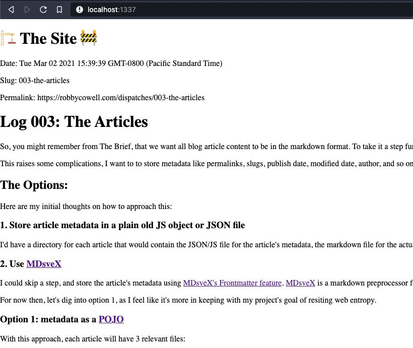

# Log 003: The Articles
So, you might remember  from The Brief, that we want all blog article content to be in the markdown format. To take it a step further, I want these articles to be 'pure' `.md` files, so no extracting from file formats like `YAML`, `MDX`, `JSX`, etc. would be required as the system and tooling choices change over time.

This raises some complications, I want to to store metadata like permalinks, slugs, publish date, modified date, author, and so on, but markdown doesn't support variables out-of-the-box so I need to come up with a way to store this information and associate it with a markdown article file.

## The Options:

Here are my initial thoughts on how to approach this:

### 1. Store article metadata in a plain old JS object or JSON file 
I'd have a directory for each article that would contain the JSON/JS file for the article's metadata, the markdown file for the actual blog article, and a `.svelte` file that imports both and brings them together on the page.

### 2. Use <a href="https://github.com/pngwn/mdsvex" target="_blank" rel="noopener noreferrer">MDsveX</a>
I could skip a step, and store the article's metadata using <a href="https://mdsvex.com/docs#frontmatter-1" target="_blank" rel="noopener noreferrer">MDsveX's Frontmatter feature</a>. <a href="https://mdsvex.com/" target="_blank" rel="noopener noreferrer">MDsveX</a> is a markdown preprocessor for Svelte, and seems like a great choice for this project, the only issue is that I'd be storing metadata in a less portable format by using the project's proprietary file format.

For now then, let's dig into option 1, as I feel like it's more in keeping with my project's goal of resiting web entropy.

### Option 1: metadata as a <a href="https://en.wikipedia.org/wiki/Plain_old_Java_object" target="_blank" rel="noopener noreferrer">POJO</a>
With this approach, each article will have 3 relevant files:
 1. A plain markdown (`.md`) file
 2. A `.js` metadata file
 3. A `.svelte` file that imports both, noting that this file maybe subject to change as tooling and frameworks change through time.

Note the distinction here: 'pure' files that act as the source for the article (1 and 2), and the framework specific 'glue' that brings them together (3). I think it's worth making this distinction in the structure of the project, so we'll have something like:

```
  src/
    /dispatches
      /003-the-articles
        /elements
          003-the-articles-metadata.js
          003-the-articles.md
        003-the-articles.svelte
```
This gives us a pure, abstracted source for each blog article and it's respective metadata, which can remain unaffected by changes to the stack in the future.

Let's use this very file as an example in this experiment and see if we can get this theory working.

The `003-the-articles-metadata.js` metadata file looks something like this:
```
  const rootURL = 'https://robbycowell.com';
  const articlesURL = 'dispatches';

  const slug = '003-the-articles'

  const metadata = {
    publishDate: new Date(Date.now()),
    slug,
    permalink: `${rootURL}/${articlesURL}/${slug}`
  };

  export default metadata;
```
The `003-the-articles.md` file is literally this one.

And we can import both in the 'glue' `003-the-articles.svelte` file like this:
```
  <script>
    import metadata from './elements/003-the-articles-metadata.js';
  </script>

  <div>
    <p>Date: {metadata.publishDate}</p>
    <p>Slug: {metadata.slug}</p>
    <p>Permalink: {metadata.permalink}</p>
  </div>
```
For testing purposes, I updates App.svelte to import this test article like so:
```
  <script>
    import Log from './dispatches/003-the-articles/003-the-articles.svelte';
  </script>

  <h1>🏗 The Site 🚧</h1>

  <div>
    <Log />
  </div>
```
Which resulted in this:



Seems to work well enough, but we can do better!